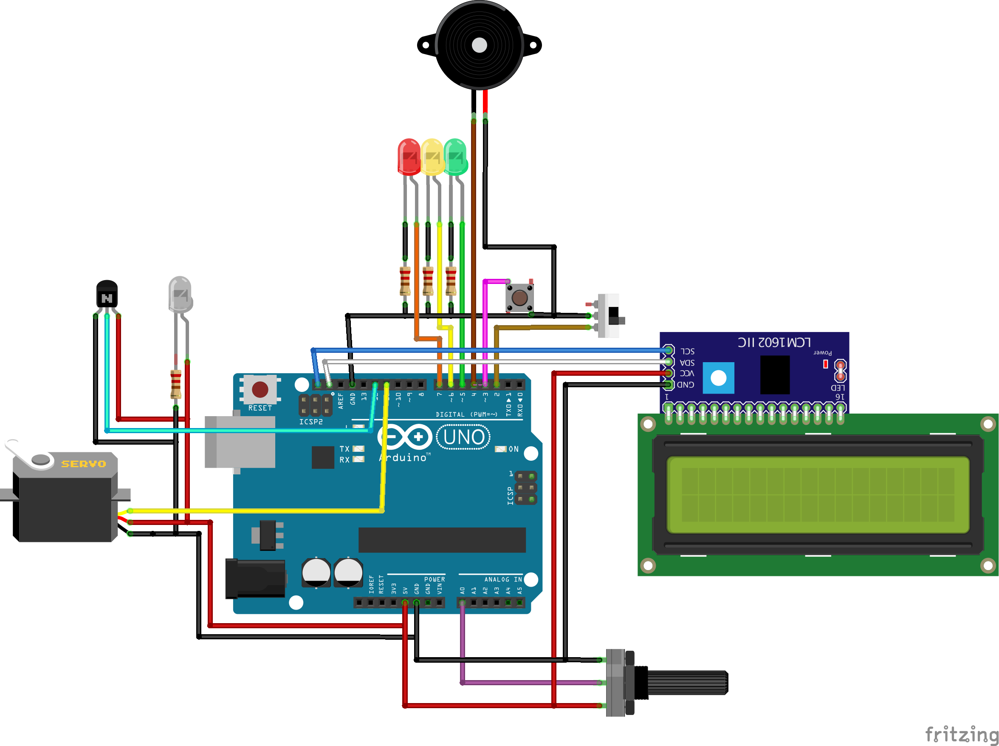

# CPAP Ventilator

CPAP (Continous positive airway pressure)-ventilation is a common form of medical therapy when people suffer from sleep related respiratory problems like sleep apnoa. Worn at night, these masks keep the patients' respiratory tracts open by inducing a continous overpressure. CPAP units are available in large numbers in common households as well as in hospitals.

More information is available [on this page](https://www.uni-marburg.de/de/fb13/halbleiterphotonik/the-breathing-project/the-breathing-project-1/the-cpap-solution).

## Hardware components

### Arduino UNO Schematic Wiring 



### Arduino UNO Pinout

```
  -DPIN_SPEAKER=2
  -DPIN_SWITCH_MODE=3
  -DPIN_BUTTON_RESET=4
  -DPIN_LED_MODE_ONE=5
  -DPIN_LED_MODE_TWO=6
  -DPIN_LED_WARN=7
  -DPIN_SERVO=11
  -DPIN_LIGHT=12
  -DPIN_POTI=A0
  -DPOTI_MIN=0
  -DPOTI_MAX=1023
```

## Deploying the Code

The project is now maintained as as a [platformio project](https://platformio.org), in order to manage dependencies and compatibility with other platforms.

The project can be build and flashed using `pio run -t upload`.

## Discussion

### Servo latency

The tube is not completely closed until the servo is done. In other words, the
air pressure is practically the same until completed. So we have to subtract the
running time from the time interval until the next closing.

We have measured for 1:1 and 1:2 resulting in an offset of round about 0.18
seconds off. This _magic_ value is removed as `SERVO_CLOSE_LATENCY`.
