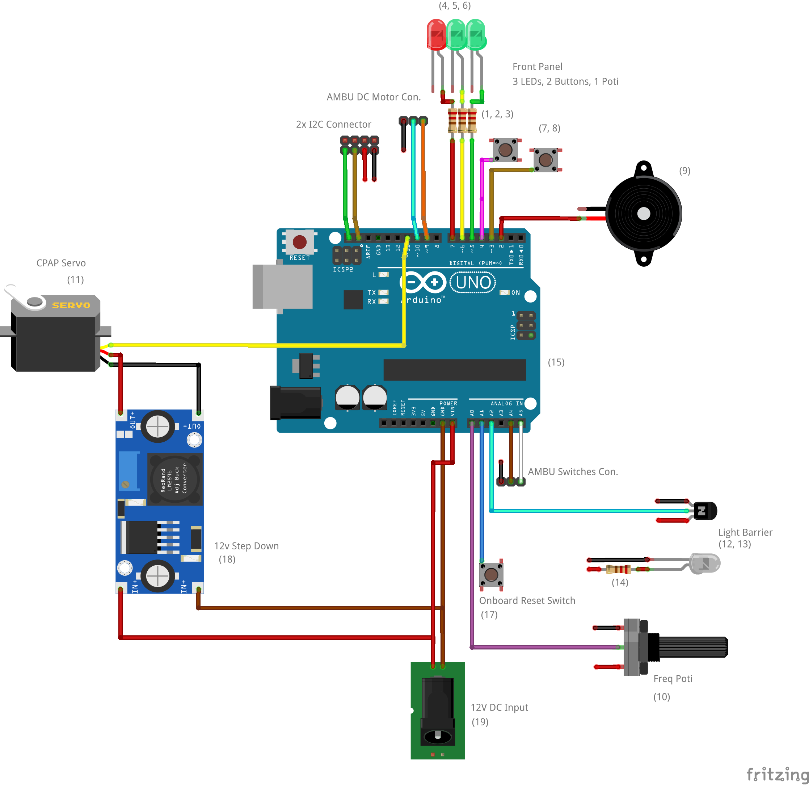

# CPAP Ventilator 

CPAP (Continous positive airway pressure)-ventilation is a common form of medical therapy when people suffer from sleep related respiratory problems like sleep apnoa. Worn at night, these masks keep the patients' respiratory tracts open by inducing a continous overpressure. CPAP units are available in large numbers in common households as well as in hospitals.

More information is available [on this page](https://www.uni-marburg.de/de/fb13/halbleiterphotonik/the-breathing-project/the-breathing-project-1/the-cpap-solution).

## Hardware components

### Arduino UNO Schematic Wiring 

### Arduino UNO Shield Design

## Deploying the Code

The project is now maintained as as a [platformio project](https://platformio.org), in order to manage dependencies and compatibility with other platforms.

The project can be build and flashed using `pio run -t upload`.
